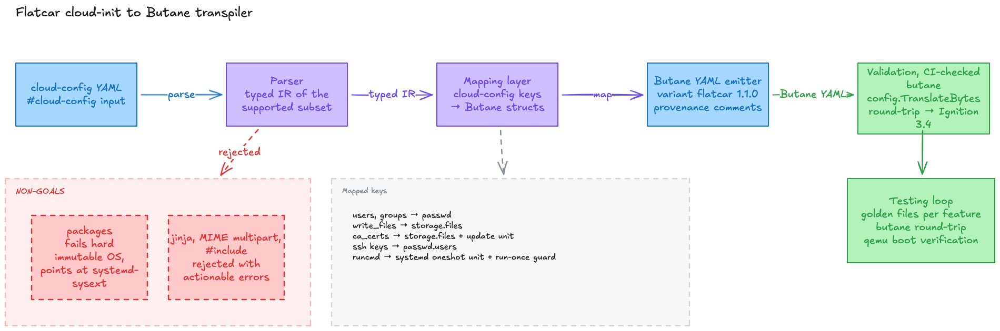

# cc2butane

[](https://github.com/ayush-that/cloud-config-to-butane/actions/workflows/ci.yml)


Transpiles a cloud-init `#cloud-config` document to a [Butane](https://coreos.github.io/butane/) config for Flatcar Container Linux (`variant: flatcar`, `version: 1.1.0`, Ignition 3.4).

Flatcar provisions with Ignition, not cloud-init. cc2butane translates the keys with a first-boot Ignition equivalent and errors on the rest, so nothing silently no-ops at boot. Scope is the subset needed to bring up a Cluster API worker node.

## Supported keys

| key | maps to |
| --- | --- |
| `write_files` | `storage.files`, octal/int perms, `b64`/`gz`/`gzip`/`gzip+base64`, `data:` URL for binary |
| `users` / `groups` | `passwd.users` / `passwd.groups`, ssh keys, `sudo` group, `hashed_passwd` |
| `ca_certs` | `storage.files` plus an `update-ca-certificates` oneshot unit |
| `runcmd` / `bootcmd` | first-boot script plus a guarded oneshot unit |

Lossy mappings are annotated inline in the emitted Butane.



## Non-goals (hard error)

- `packages` / `package_update` / `package_upgrade`. Immutable OS, use `systemd-sysext`. `--warn-unsupported` drops with a warning.
- MIME multipart, `#include`, `#cloud-config-archive`, boothooks, shell-script user-data.
- Jinja (`## template: jinja`). Render before transpiling.
- `bootcmd` every-boot semantics collapse to run-once, noted inline.

## Usage

```bash
go run ./cmd/cc2butane cloud-config.yaml > worker.bu   # or read from stdin
```

`--strict` turns `runcmd`/`bootcmd` into errors. `--warn-unsupported` drops unsupported keys.

## Validation

Every golden output is fed through Butane's own library (`github.com/coreos/butane/config`) and the test fails on a fatal report, so output is always valid Butane 1.1.0. CI runs it on push.

```bash
go run ./cmd/cc2butane cloud-config.yaml | go run ./cmd/butanecheck
```
